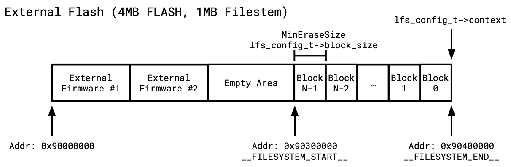

# Filesystem Management
GnWManager supports interactions with a [LittleFS](https://github.com/littlefs-project/littlefs) partition on the Game & Watch's external SPI Flash.

In general, the external SPI flash layout is as follows:

<center>
    
</center>

#### Format
Format a new filesystem partition.

```bash
gnwmanager format [OPTIONS]
```

Help string:
```bash
╭─ Options ─────────────────────────────────────────────────────────────────────────────────────────────────────────╮
│ --size            INT_PARSER  Size of filesystem. Defaults to previous filesystem size.                           │
│ --offset          INT_PARSER  Distance in bytes from the END of the filesystem, to the END of flash. [default: 0] │
╰───────────────────────────────────────────────────────────────────────────────────────────────────────────────────╯
```

If no `--size` is specified, and a previous filesystem existed, it will format to the old filesystem's size.

#### Shell
Enter an interactive unix-like shell. All commands in this tutorial are available in the interactive shell.

```bash
gnwmanager shell
```

For example:

```bash
$ gnwmanager shell
Interactive shell. Press Ctrl-D to exit.
gnw$ mkdir hello-world
gnw$ mkdir hello-world/foo/bar/baz
gnw$ tree
.
└── [      0B DIR                     ] hello-world
    └── [      0B DIR                     ] foo
        └── [      0B DIR                     ] bar
```

Note: `*` wildcard for files/folders will **not** be expanded by gnwmanager's shell.
`*` wildcard expansion is handled by your computer's shell.

#### ls
List the contents of a directory

```bash
gnwmanager ls
```

Example:

```bash
$ gnwmanager ls hello-world
      0B DIR                      foo
```

#### tree
List contents of device directory and its descendants.

Help string:
```bash
$ gnwmanager tree --help

 Usage: gnwmanager tree [OPTIONS] [PATH]

 List contents of device directory and its descendants.

╭─ Arguments ───────────────────────────────────────────────────────────────────────────────────────────────────────╮
│   path      [PATH]  On-device folder path to list. Defaults to root [default: .]                                  │
╰───────────────────────────────────────────────────────────────────────────────────────────────────────────────────╯
╭─ Options ─────────────────────────────────────────────────────────────────────────────────────────────────────────╮
│ --depth           INT_PARSER  Maximum depth of the directory tree. [default: 2]                                   │
│ --offset          INT_PARSER  Distance in bytes from the END of the filesystem, to the END of flash. [default: 0] │
│ --help    -h                  Show this message and exit.                                                         │
╰───────────────────────────────────────────────────────────────────────────────────────────────────────────────────╯
```

Example:
```bash
$ gnwmanager tree hello-world
hello-world
└── [      0B DIR                     ] foo
    └── [      0B DIR                     ] bar
        └── [      0B DIR                     ] baz
```

#### mkdir
Creates a folder (and all necessary parenting folders) on-device.
```bash
gnwmanager mkdir my_directory_name
```

This is most equivalent to `mkdir -p my_new_dir` on Unix systems.
If the directory already exists, no action is performed.

#### mv
Moves/Renames a file/folder on-device. Not for transferring data to/from computer.
```bash
gnwmanager mv src dst
```

#### cp
Copies a file/folder on-device. Not for transferring data to/from computer.
```bash
gnwmanager cp src dst
```

#### push
Pushes file(s) and folder(s) to device.
```bash
gnwmanager push
```

Help string:
```bash
$ gnwmanager push --help

 Usage: gnwmanager push [OPTIONS] GNW_PATH LOCAL_PATHS...

 Push file(s) and folder(s) to device.

╭─ Arguments ───────────────────────────────────────────────────────────────────────────────────────────────────────╮
│ *    gnw_path         PATH            Game-and-watch file or folder to write to. [required]                       │
│ *    local_paths      LOCAL_PATHS...  Local file or folder to copy data from. [required]                          │
╰───────────────────────────────────────────────────────────────────────────────────────────────────────────────────╯
╭─ Options ─────────────────────────────────────────────────────────────────────────────────────────────────────────╮
│ --offset          INT_PARSER  Distance in bytes from the END of the filesystem, to the END of flash. [default: 0] │
│ --help    -h                  Show this message and exit.                                                         │
╰───────────────────────────────────────────────────────────────────────────────────────────────────────────────────╯
```

Note that the destination `gnw_path` **is the first argument**.
Pushing files follows the same rules as the unix `cp -r` outlined below:

1. **Pushing a directory to another location without a target directory name specified:**
   ```bash
   gnwmanager push /destination/ /source/directory
   ```
   This will push the `/source/directory` to `/destination/directory`.
   If `/destination/directory` does not already exist, it will be created.
   If it does exist, the contents of `/source/directory` will be merged into the existing `/destination/directory`.

2. **Pushing a directory to another location with a target directory name specified:**
   ```bash
   gnwmanager push /destination/newname /source/directory
   ```
   This will copy /source/directory to /destination/newname.
   If `/destination/newname` does not already exist, it will be created.
   If it does exist and is a directory, the contents of `/source/directory` will be merged into the existing `/destination/newname`.
   If `/destination/newname` exists and is a file, the command will fail.

3. **Copying only the contents of a directory:**
   ```bash
   gnwmanager push /destination/ /source/directory/*
   ```
   By using the `*` wildcard, you're selecting all items inside `/source/directory`.
   These items will be copied directly into `/destination/`.
   If `/destination/` has some of the same named items, they will be overwritten by the ones from `/source/directory`.
   If `/destination/` does not exist, it (and any required parents) will be created.


#### pull
Pulls file(s) and folder(s) from device.

```bash
gnwmanager pull
```

Help string:

```bash
$ gnwmanager pull --help

 Usage: gnwmanager pull [OPTIONS] GNW_PATH LOCAL_PATH

 Pull a file or folder from device.

╭─ Arguments ──────────────────────────────────────────────────────────────────────────────────────────────────────╮
│ *    gnw_path        PATH  Game-and-watch file or folder to copy to computer. [required]                         │
│ *    local_path      PATH  Local file or folder to copy data to. [required]                                      │
╰──────────────────────────────────────────────────────────────────────────────────────────────────────────────────╯
╭─ Options ────────────────────────────────────────────────────────────────────────────────────────────────────────╮
│ --offset          INT_PARSER  Distance in bytes from the END of the filesystem, to the END of flash. [default: 0]│
│ --help    -h                  Show this message and exit.                                                        │
╰──────────────────────────────────────────────────────────────────────────────────────────────────────────────────╯
```

Note that the source `gnw_path` **is the first argument**.
