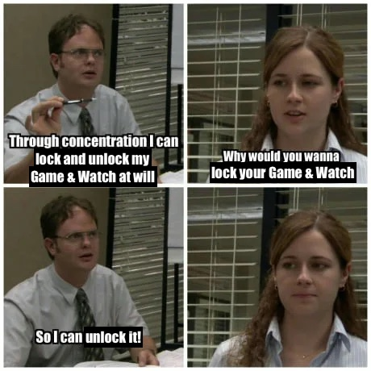

# Locking a Game & Watch Device
Why would you want to re-lock a Game & Watch Device? So you can unlock it again!

<center>
    
</center>

To lock your device, run:

```bash
gnwmanager lock PATH_TO_BACKUP
```

where `PATH_TO_BACKUP` is the folder that was generated from a `gnwmanager unlock` command.

For example:

```bash
gnwmanager lock backups-2023-10-25-12-49-51
```

The actual backup isn't used during the locking process, but `gnwmanager` will confirm that
the backup is valid prior to re-locking the device. This is purely a safety measure.
